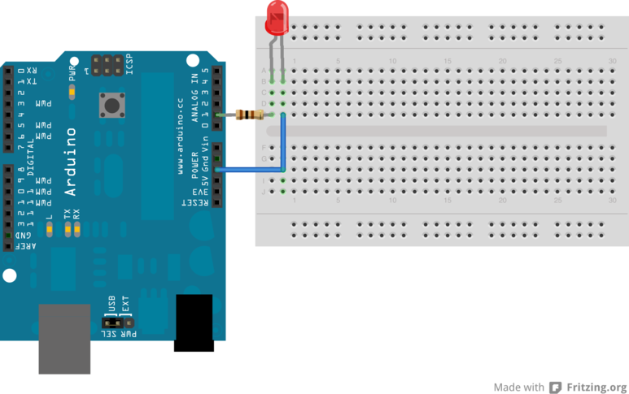

Blinkende LED
=============

Wir schliessen einen 100 Ohm Widerstand zwischen einem analogen Pin des Arduino (hier: A1) und dem langen Bein einer LED. 
Das kurze Bein der LED verbinden wir mit GND. 




```c++

    /*
      Lasse eine LED im sekundentakt blinken.
    */

    // die LED ist an diesem Pin angeschlossen
    int led = A1;

    // initalisiere den LED Pin als Output
    void setup() {
      pinMode(led, OUTPUT);
    }

    // Dies ist die Hauptroutine
    void loop() {
      digitalWrite(led, HIGH);   // LED leuchtet
      delay(1000);               // Pause eine Sekunde
      digitalWrite(led, LOW);    // LED ist aus
      delay(1000);               // Pause eine Sekunde
    }
```


