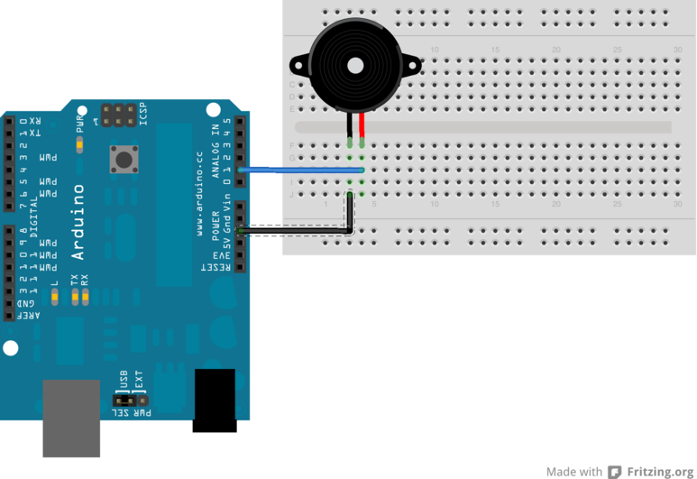

Beispiel Buzzer
======================

Wir verbinden den *+*Pol des Piezo-Buzzers mit Pin A1 und den anderen mit Masse (GND).



Der Beispielcode findet sich in der Datei [Buzzer.ino](Buzzer.ino).

```c++
/*
  Generiere Laerm mit einem Piezo-Buzzer
 */

// der Buzzer ist an diesen Pin angeschlossen
int buzzer = A1;

// initalisiere den Pin als Output
void setup() {
  pinMode(buzzer, OUTPUT);
}

// Dies ist die Hauptroutine
void loop() {
  summer(random(100, 5000), random(100,500));
  delay(50);
}

void summer(long frequenz, long dauer) {
  long pause = 1000000/frequenz/2;          // Pause ist abhaengig von der Frequenz
  long zyklen = frequenz * dauer/ 1000;     // Wir rechnen die Frequenz um in Zyklen
  for (long i=0; i < zyklen; i++){
    digitalWrite(buzzer,HIGH);
    delayMicroseconds(pause);
    digitalWrite(buzzer,LOW);
    delayMicroseconds(pause);
  }
}
```


