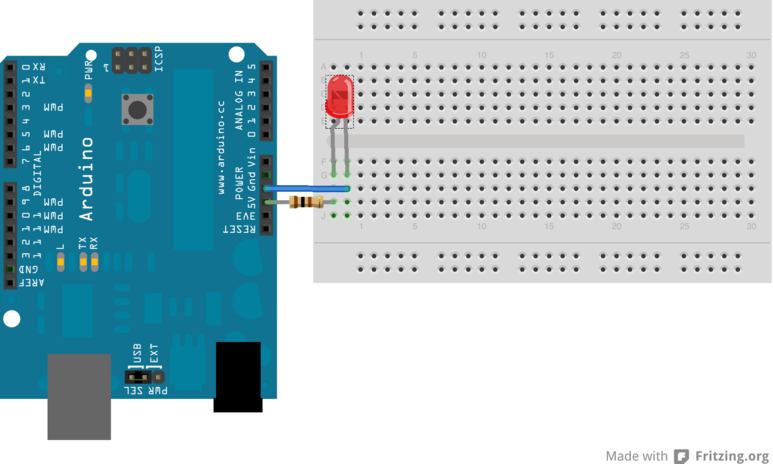

Einfaches LED Beispiel
======================

Wir schliessen einen 100 Ohm Widerstand zwischen dem 5V Pin des Arduino und dem langen Bein einer LED. 
Das kurze Bein der LED verbinden wir mit GND. Wenn wir den Arduino mit Strom versorgen, sollte die LED leuchten.

