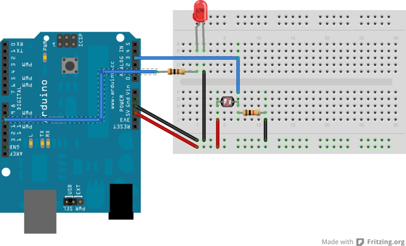

Beispiel Lichtsensor
======================

Wir schliessen einen 100 Ohm Widerstand zwischen einem digitalen Pin des Arduino (hier: 10) und dem langen Bein einer LED. 
Das kurze Bein der LED verbinden wir mit Masse (GND). 
Zusätzlich verbinden wir einen Pin (Orientierung egal) des Photowiderstandes (photocell) mit 5V, den anderen Pin sowohl mit A3 als auch über einem 10k Widerstand mit Masse (GND) 



Der Beispielcode findet sich in der Datei [Lichtsensor.ino](Lichtsensor.ino).

```c++
/*
  Regle die Helligkeit einer LED mit einem Lichtsensor.
 Je dunkler der Lichtsensor, desto heller die LED.
 */

// die LED ist an diesen Pin angeschlossen
int led = 10;

// der Lichtsensor ist an diesen Pin angeschlossen
int lichtsensor = A3;

// initalisiere den LED Pin als Output, den Lichtsensor Pin als Input
void setup() {
  pinMode(led, OUTPUT);
  pinMode(lichtsensor, INPUT);
}

// Dies ist die Hauptroutine
void loop() {

  // Lese die Helligkeit vom Lichtsensor ein
  byte Helligkeit = analogRead(lichtsensor);

  // Kehre den Wert des Sensors um
  Helligkeit = map(Helligkeit, 0, 255, 255, 0);

  analogWrite(led, Helligkeit);
  delay(10);
}
```


