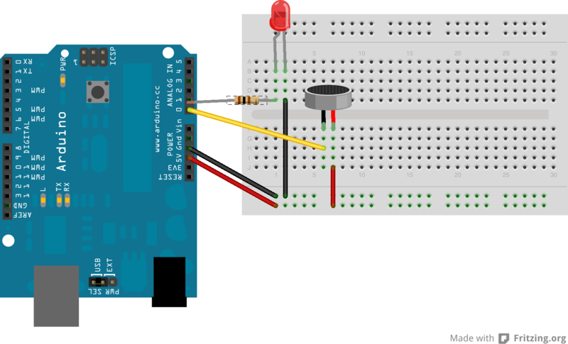

Beispiel Vibrationssensor
======================

Wir verbinden eine LED mit analog Pin A1 und schliessen
den längeren Pin des Vibrationssensors an 5V, den Kurzen an analog Pin A0.
Die LED sollte kurz leuchten, wann immer der Vibrationssensor geschüttelt wird.



Der Beispielcode findet sich in der Datei [Vibrationssensor.ino](Vibrationssensor.ino).

```c++
// der Sensor ist an diesen Pin angeschlossen
int Vibrationssensor = A0;
int LED = A1;
int schwelle = 975;

// initalisiere den Pin als Input
void setup() {
  pinMode(Vibrationssensor, INPUT);
  pinMode(LED, OUTPUT);
  Serial.begin(9600);
  byte runtimer = 200;
}

// Dies ist die Hauptroutine
void loop() {
  int messwert = analogRead(Vibrationssensor);

  Serial.println(messwert);

  int ledwert = map(messwert, 0,1024, 0, 255);
  if (messwert > schwelle){
    digitalWrite(LED, ledwert);
    delay(500);
    digitalWrite(LED, LOW);
  };

  delay(100);
}
```
