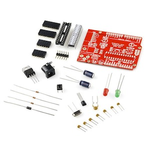
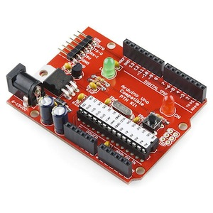

Arduino Workshop
====================

Hier findet sich eine kurze Anleitung für den [Arduino](http://www.arduino.cc) Workshop des [RaumZeitLabors](http://www.raumzeitlabor.de).

Dies ist nicht als eigenständiges Tutorial gedacht, sondern vielmehr als Ergänzung sowie Link- & Dateisammlung zum Workshop.

Ziel des Workshops
------------------

Wir werden diesen Bausatz 

zusammenloeten zu: 

siehe (englische) [Bauanleitung](http://dlnmh9ip6v2uc.cloudfront.net/datasheets/Kits/SFE03-0010-KitCard-ArduinoPTH-ReadersSpreads.pdf)

Software
--------

Um einen Arduino zu programmieren, braucht man nur die freie und quelloffene Arduino Entwicklungsumgebung. 
Es gibt sie für 
[Windows](http://arduino.cc/en/Guide/Windows),
[Mac](http://arduino.cc/en/Guide/MacOSX), und 
[Linux](http://www.arduino.cc/playground/Learning/Linux)

Eine Beschreibung der Software findet sich unter
[http://www.arduino-tutorial.de/2010/06/arduino-software/]() (deutsch) bzw.
[http://arduino.cc/en/Guide/Environment]() (englisch)

Viele Tutorials sowie weitergehende Erklärungen finden sich bei [http://www.arduino-tutorial.de/]()

Programmierung
--------------
Der Arduino wird mit per USB/Seriell-Adapter mit Strom versorgt und von der Entwicklungsumgebung programmiert.

Erster Test
-----------

Schliesse den Arduino via USB/Seriell-Adapter an Deinen Rechner an, starte die
Arduino Entwicklungsumgebung und wähle aus dem Datei-Menü "Beispiele"
(Examples) "01 Basics" das Beispiel "Blink" aus. Nachdem Du es per "Upload" auf
den Arduino ueberspielt hast, sollte die kleine LED auf Deinem Arduino im
Sekundentakt blinken...

Beispielprogramme
-----------------

* [LED Test](./BeispielProgramme/01_LED/LED.md)
* [blinkende LED](./BeispielProgramme/02_LED_blink/LED_blink.html)
* Mini Photocell 
* Beeper/Buzzer 
* Potentiometer
* Vibration Switch Sensor 

Weiterführende Links
--------------------

- [Arduino Programmier Handbuch](http://www.freeduino.de/de/books/arduino-programmier-handbuch)
- [Willies World](http://klaas.homeip.net/ArduinoWiki/doku.php?id=arduino:einleitung)
- [Arduino-Tutorial](http://www.arduino-tutorial.de/)
